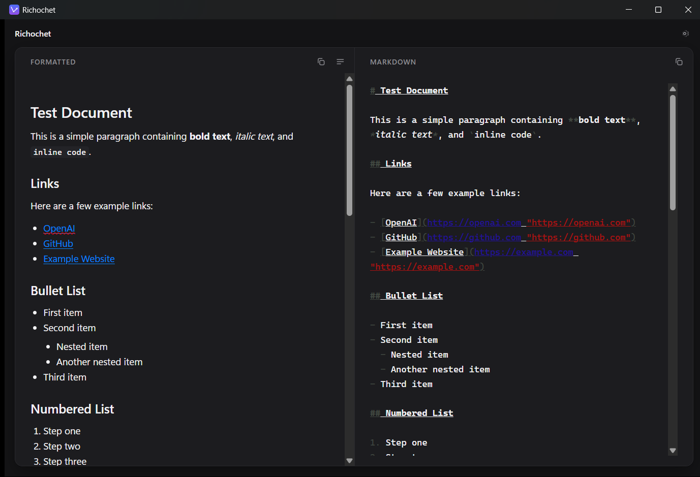
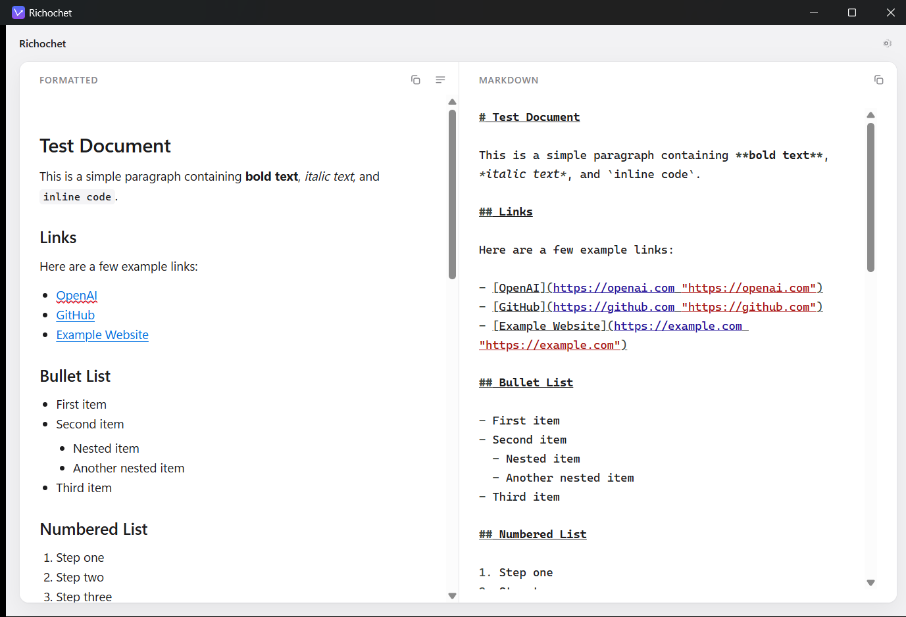

# Richochet

[](https://github.com/echozulucode/richochet/actions/workflows/ci.yml)
[](LICENSE)

Paste rich text from Microsoft Teams, get clean Markdown. Write Markdown, copy it back into Teams
with the formatting intact. **Windows only** — the clipboard layer is Win32 by design.

_"rich text" + "ricochet"_ — content bouncing between formats. The `h` is deliberate.

Teams supports a Markdown-_style_ syntax that Microsoft explicitly documents as **not** standard
Markdown, so Richochet doesn't try to translate one syntax into the other. Everything normalizes
into a small document model, and Markdown, HTML and plain text are each generated from that.

<p align="center">
  
  
</p>

<p align="center"><sub>Two panes over one document. Edit either side; the other follows.</sub></p>

## Install

Grab the installer from [Releases](https://github.com/echozulucode/richochet/releases/latest) —
`Richochet_<version>_x64-setup.exe`. It installs per-user into
`%LOCALAPPDATA%\Richochet`, so there is no admin prompt.

On first run, Windows SmartScreen will warn about an unrecognized publisher: click **More info** →
**Run anyway**. The installer isn't Authenticode-signed — a certificate costs real money per year,
and for a 0.x release that tradeoff isn't worth it yet.

## Build it yourself

```sh
just setup    # install dependencies (once)
just dev      # run the app with hot reload
just test     # the full suite
just build    # release installer
```

`just` with no arguments lists every recipe. It is the only entry point — there is no raw
`cargo`/`pnpm` incantation you are expected to remember.

`just build` signs the installer for the auto-updater, so it needs the private signing key. It checks
for it before doing anything and stops immediately if it is missing:

```powershell
$env:TAURI_SIGNING_PRIVATE_KEY = "$HOME\.tauri\richochet-updater.key"   # a path is accepted
$env:TAURI_SIGNING_PRIVATE_KEY_PASSWORD = "<passphrase>"
just build
```

No key? `just build-unsigned` builds a working installer without updater signing. It installs and
runs normally, but it has no `.sig`, so it can never be offered as an update — use it to test a
build locally, never to publish one.

`just dev`, `just test` and `just ci` need none of this — only bundling signs.

## How it's put together

```text
Teams clipboard ──► html::parse ──┐
Markdown ─────────► markdown::parse ──►  Document  ──► markdown::render ──► Markdown
Plain text ───────► text::parse ──┘      (the AST)  ──► html::render ─────► Teams clipboard
                                                    └─► text::render ─────► plain text
```

- **`crates/mdcore`** — the conversion engine. Pure library, no Tauri, no I/O, tests run in
  milliseconds. This is where the interesting work is.
- **`src-tauri`** — a thin shell owning the window, the IPC surface and the Win32 clipboard.
- **`src`** — React + TypeScript, two editor panes over one shared document.
- **`tests/fixtures`** — the golden corpus. A newly discovered Teams quirk becomes a directory
  here, not a branch in the code.

The HTML dialect Teams accepts is expressed as **data** (`RenderProfile`), not baked into the
renderer, so tuning fidelity means editing a struct literal and adding a fixture.

## Docs

| File                          | What it's for                                              |
| ----------------------------- | ---------------------------------------------------------- |
| `docs/plan.md`                | Design rationale — why the architecture is shaped this way |
| `docs/implementation-plan.md` | The phased build order, task tables, exit criteria         |
| `docs/clipboard-findings.md`  | What Teams actually puts on the clipboard (Phase 1)        |
| `docs/release-plan.md`        | Installers, GitHub Actions, auto-updates, code signing     |
| `docs/adr/`                   | Decisions that would be expensive to reverse               |
| `AGENTS.md`                   | Working agreement for agents and contributors              |

## Status

Pre-release. Windows only — the clipboard layer is Win32 by design
(`docs/adr/0001-clipboard-strategy.md`); the `read`/`write` seam is platform-neutral, so other
platforms are an additive change rather than a redesign.
